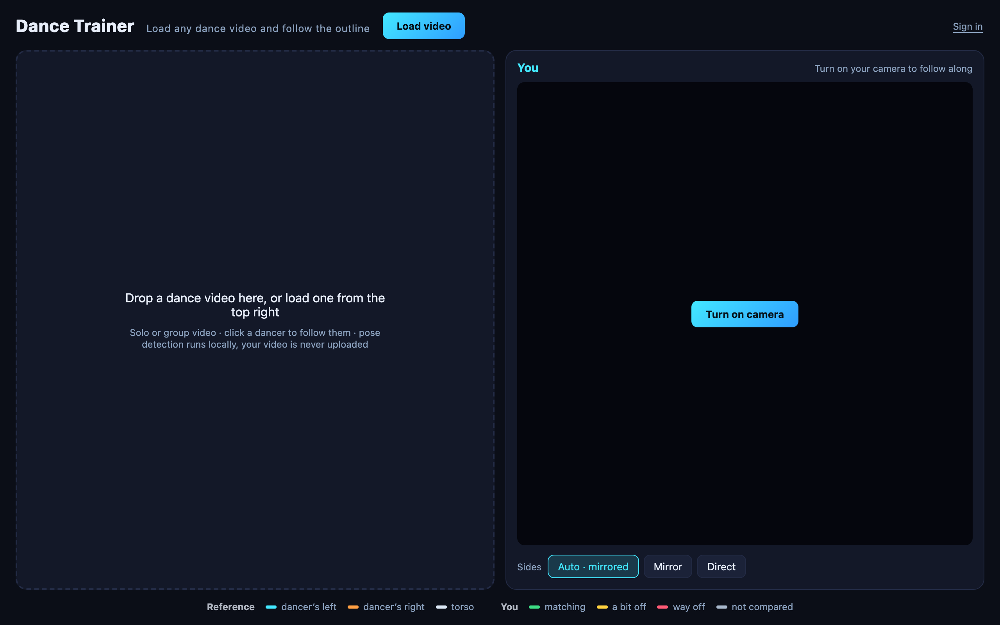

# Dance Trainer

<p align="center">
  
</p>

<p align="center"><a href="https://dance-trainer.fly.dev"><b>Try it in your browser</b></a></p>

Turn any dance video into a practice room: skeleton overlay, mirror, slow motion, A-B loop, and a webcam view that shows you where you are off.

Video and webcam frames are processed **entirely in the browser** — neither your video nor your camera feed is ever uploaded. By default the app makes no requests to any server of mine at all.

Accounts are optional and off by default (see [Accounts](#accounts-optional)); when enabled, the only thing stored is aggregate practice numbers — how long you practised and how closely you matched.

## Why this exists

Learning a dance from a video means pausing, scrubbing back, and guessing why it
still looks wrong. A mirror tells you what you are doing but not what you should
be doing; the video tells you the opposite. Neither tells you *which limb* is off.

So the app puts both on screen and scores them against each other per limb. That
turns out to be mostly a set of problems that have nothing to do with dancing:

- **A learner is always late.** Scoring frame against frame calls a correct move
  wrong simply because it landed 200 ms behind, so the comparison has to search a
  small time window before it decides you missed.
- **Group videos have several skeletons**, and the one you are following keeps
  walking behind someone else — so a chosen dancer has to be tracked, not
  re-detected.
- **Mirroring cannot be assumed.** Some videos are already mirrored, some are
  not, and telling a learner to move the wrong arm is worse than saying nothing.
- **Holding still should look still.** Raw landmarks jitter, and a skeleton that
  shivers reads as "you are wrong" when you are not.

Each of those is worked through in [How it works](#how-it-works).

The other constraint was that dance video is personal — someone's rehearsal
footage, or their living room. Nothing is uploaded: pose detection, the video,
and the camera all stay on the machine.

## Tech stack

| Layer | Tools |
| --- | --- |
| Pose | MediaPipe Tasks Vision, in-browser via WASM |
| UI | React 19, TypeScript, Vite |
| Rendering | Canvas 2D overlays over `<video>` |
| Storage | IndexedDB for the local video library — files never leave the device |
| Accounts | [playkit](https://github.com/Chuyuyan/playkit) SDK, optional and off by default |
| Smoothing | 1 Euro filter (see [Holding still](#holding-still-should-look-still)) |

## What it does

**Reference panel**

- Load (or drop in) any video; the dancer's skeleton is extracted per frame and drawn over it
- **Left and right limbs in different colours** — the dancer's left side cyan, right side orange, torso neutral, so it is obvious which leg is moving
- Mirror, so you do not have to flip left and right in your head
- 0.25x / 0.5x / 0.75x / 1x playback
- A-B loop, for drilling one eight-count
- *Outline only* dims the footage and leaves the skeleton, which makes lines and travel easier to read
- *Zoom*, three settings:
  - **Off** — the whole frame
  - **Fit** (recommended) — settles on a framing and then holds it
  - **Follow** — keeps the dancer centred, for footage where they travel
- Group video: click a dancer to lock onto them
- *Fingers* — overlays a 21-point hand skeleton (off by default, see below)
- **Library** — every video you open is remembered, with a poster frame, so the next session is one click away instead of another trip through the file picker
- **Sections** — mark the phrases of a routine with one click each, then click one to loop it. Practice is charged to the phrase you were actually dancing, so you can see which eight-count you have been avoiding

**You panel**

- Your skeleton, live from the webcam
- Compared with the reference frame by frame **by joint angle**, with the skeleton coloured by how far off each joint is: green matching, yellow a bit off, red way off, grey not compared
- A smoothed match score, plus how far **behind the beat** you are — being late is reported as timing, not scored as a wrong move
- A prompt naming the joints that are furthest off, head turn included
- Landmarks are filtered, so standing still gives a still skeleton and a steady score
- *Sides*: Auto works out whether the reference dancer faces the camera and mirrors only when it should, so tutorials filmed from behind are not marked wrong
- This side deliberately does **not** colour by left and right. Colour is spent on the more useful signal, and two colour languages on one skeleton would collide.

## Running it

```bash
npm install   # also runs npm run setup, which fetches the models and WASM
npm run dev
```

`npm run setup` copies MediaPipe's WASM runtime out of `node_modules` into `public/wasm` and downloads the pose and hand models into `public/models` (about 38 MB, kept out of version control). After that it runs offline.

## How it works

**Pose estimation** — MediaPipe Tasks Vision `pose_landmarker_lite`, BlazePose's 33 landmarks, GPU delegate with an automatic CPU fallback. All inference runs in the browser.

**Why joint angles rather than coordinates** — bodies, positions and camera distances all differ, so comparing coordinates is meaningless. Comparing the angles at eight joints (both elbows, shoulders, hips and knees) is naturally invariant to translation and scale.

**Angles need an aspect correction** — landmarks are normalised per axis, so x is squashed by the frame's aspect ratio. The video and the webcam rarely share an aspect ratio, so without correcting for it the two sides' angles are computed in differently distorted spaces and the comparison carries a systematic bias. `computeAngles` scales x back into units of frame height.

### Picking a dancer in a group video: crop and track

The main piece of engineering here.

Measured behaviour, identical across the lite, full and heavy models: when two people are **similar in size**, `numPoses > 1` finds both; as soon as one is noticeably smaller, BlazePose's person detector reports only the dominant one, and lowering the confidence thresholds does not help. Whole-frame detection plus a click test therefore cannot select a secondary dancer at all.

So it does what practical multi-person systems do — detect, crop, then single-person pose:

1. A click runs one whole-frame detection. That pose is used **only if the click actually landed on it** (`poseHit`); otherwise a default-sized box is opened at the click point. This step matters: `pickPose` returns the nearest pose however far away it is, so without the hit test, clicking a dancer the detector cannot see snaps the selection onto the one it can.
2. Every frame after that, only this box — square, so nothing is stretched — is scaled to 384x384 and run through the model as a single pose.
3. The landmarks are projected back into whole-frame normalised coordinates (`unproject`) for drawing and angle maths.
4. The box eases along with the dancer. If detection fails it widens gradually, and after 20 lost frames the lock is dropped and whole-frame tracking resumes.

Cropped, the subject fills the frame, so small dancers are detected reliably and with better precision.

### Zoom is a display-layer transform, and the hard part is holding still

Work out the largest scale the dancer still fits in, then use a CSS transform to scale and pan the video and the overlay together.

The first version took the **current frame's** bounding box as the target, and shook constantly. The cause is structural rather than numerical: the box widens when the dancer extends an arm and narrows when they pull it in, so the shot breathes — and the more it is zoomed, the more that wobble is amplified on screen, multiplied by the scale. Zooming as far as possible is itself what produces the shake.

What it does now:

- **Fit: watch briefly, commit to a framing, then freeze.** For the first 1.5 seconds the bounding boxes are accumulated into a union; once that settles, 8% of headroom is added and the framing is **fixed**. After that it does not move at all unless the dancer would actually be clipped, in which case it expands once and freezes again. To stop a single misdetection widening the shot permanently, frames whose box balloons past 3x the current area are discarded.

  The first attempt did the union and a deadband but no freeze — and the union keeps growing as the dancer moves, nudging the shot every time it does, so it **still moved**. That is the difference between "mostly still" and actually still; only freezing counts.

  The warm-up is measured in **wall-clock time, not frames**. A frame count drags on for seconds on a slow machine or a background tab, leaving the shot drifting the whole time.

- **Follow** smooths the box heavily (EMA), so the centre tracks the dancer while the size barely responds to arms opening and closing.

- **Both modes share a deadband**: scale changes under 5% and pans under 8px are ignored. This is what "not shaking" rests on. Without it the shot is continuously making small corrections, which reads as jitter.

- **The cap is 2.5x.** Past that the source has no more detail to give and it only magnifies blur.

- **A dropped pose no longer snaps back.** A missed detection used to reset the target to 1x and jolt the picture; now the last framing is kept.

Measured on a clip where the dancer drifts about 110px side to side, looping: after freezing, the framing takes **exactly one value** and never moves; the three changes before that are the initial push-in. Follow, on the same clip, changes three times, with scale steady at 2.4-2.5 and only the pan tracking the dancer.

Three smaller points:

1. The transform goes on **a single container wrapping both the video and the canvas**, so they scale together and the overlay never drifts out of register.
2. Each frame eases toward the target, and the pan is **clamped** so the frame always covers the stage and never pans into the void.
3. The transform is written straight to the DOM (`style.transform`) rather than through React state. It runs every frame, and a re-render per frame would be wasteful.

Because it is a uniform scale and pan, the click-to-select coordinate mapping keeps working with no extra inverse maths — clicking the centre of a zoomed-in stage still locks on correctly.

Note that **zoom depends on someone already being detected**. In a wide shot where the dancer is too small, whole-frame detection fails anyway; clicking them first, which takes the crop-and-track path, gets you both the skeleton and the zoom.

### Fingers: also cropped, and anchored to the wrist

Running HandLandmarker on the whole frame does not work. Hands are small in dance footage, and at thresholds low enough to find them the model starts reporting **feet as hands**. That is not hypothetical: it reported a wrist at y=0.805, down at the ankles, and drew a complete hand there.

The fix is not more threshold tuning but removing the possibility. Take the wrist and elbow the pose already found, open a box just past the wrist — hands extend away from the elbow — sized off shoulder width, and look for a hand only inside it. That rules out the foot-as-hand failure entirely, and hands the model a subject that fills the frame. One landmarker per hand, so the colour comes from the side directly and handedness never has to be guessed.

It costs two extra inference passes per frame, so it is a toggle, off by default.

**Separate landmarker instances** — a VIDEO-mode tracker carries internal state across frames, so feeding one instance different framings corrupts its predictions, visibly, as a scrambled skeleton. Whole-frame pose, cropped pose, left hand and right hand each get their own instance, each with its own monotonically increasing timestamps.

### The library keeps videos, not uploads them

Opening a video adds it to a library: poster frame, duration, when you last
danced it, and — signed in — how long you have practised it and your best match.

The constraint that shapes the whole design is that **the footage cannot go to a
server**. That is the promise the rest of the app makes, so the library keeps
files in IndexedDB on the device, and an account syncs only the index: names,
durations, recency, and practice totals. On a second device you see what you
have been working on; the video is not there, and the entry says so.

- Files are identified by name, size and modification time, hashed. Hashing the
  contents would be exact, but it means streaming a whole video just to notice
  you have opened it before. The weaker key is enough to recognise the same file
  and cheap enough to run on every load.
- Metadata and footage live in **separate object stores**, so listing the
  library never pulls hundreds of megabytes off disk to render a few rows.
- Video is big and quota is finite, so a single file over 300 MB is indexed but
  not stored, and older footage is dropped once the library passes ~1.5 GB or 12
  videos. **Records are never dropped** — an entry whose file is gone shows *not
  on this device* and re-links itself, thumbnail and history intact, the next
  time you pick that file.
- Everything degrades to the old behaviour: if IndexedDB is unavailable or the
  quota is refused, the app still plays the video, it just does not remember it.

Practice sessions now carry the video's id, which is what lets the list show
per-dance totals instead of one global number.

### Scoring has to forgive lag, or it calls every learner wrong

The first version compared your pose to the reference's pose *in the same
frame*. That is indefensible for the thing this app is for: someone learning a
routine is always behind it — you watch, you react, you move — and at ordinary
tempo a third of a second is already a different shape. So doing the move
correctly, slightly late, scored as doing it wrong. Tested on a real body the
verdict was exactly that: hard to keep up, and it keeps saying you are wrong.

Now the reference keeps a rolling one-second window of frames, and your pose is
scored against the best match in it. What you were copying a moment ago is in
that window, so the delay stops being counted as a mistake — and the size of
the delay becomes its own readout, which is the more useful coaching note:
*right shape, 0.4s behind* rather than an unexplained red limb.

Simulated on a synthetic routine, comparing the same movement performed late:

| lag | old score | new score | reported |
| --- | --- | --- | --- |
| 0.1s | 92 | 100 | 0.10s |
| 0.3s | 76 | 100 | 0.30s |
| 0.5s | 63 | 100 | 0.50s |
| 0.8s | 52 | 100 | 0.80s |

A genuinely wrong pose still scores 29 against the whole window, so this buys
tolerance without making everything green.

Thresholds were loosened too (25/50 degrees rather than 20/45). Two-dimensional
angles carry real noise — landmark jitter, body proportions, camera height —
and a learner told "wrong" over 20 degrees stops believing the feedback, which
costs more than the precision is worth.

### Mirroring is detected, not assumed

Dance tutorials are routinely filmed from behind so you can copy directly.
Mirroring those turns every asymmetric move into an error, and mirroring was
previously on by default.

Facing is now read off the pose: someone facing the camera has their anatomical
left at a greater image x than their right, and turned away the order flips. So
*Auto* mirrors only when the reference dancer faces their camera — you always
face yours. Side-on frames report nothing and hold the last confident reading.
Manual *Mirror* and *Direct* remain for when it guesses wrong.

### Holding still should look still

Pose estimation runs independently on every frame, so a body standing
motionless still produces landmarks that wander a few pixels. On screen that
reads as the skeleton twitching while you stand there, and it makes the match
score fidget for no reason — which is worse than cosmetic, because it leaves
you unsure whether you actually did something wrong.

A moving average would remove it and add lag, which is precisely what this app
cannot spend after going to some trouble to stop treating lag as error. So the
landmarks go through a [One Euro
filter](https://gery.casiez.net/1euro/) instead: its cutoff rises with the
speed of the signal, so a still limb is smoothed hard and a fast one is barely
touched.

Parameters were picked by sweeping against a simulated limb with
landmark-scale noise rather than by eye. Beta is the lever that matters:

| minCutoff | beta | still jitter | lag while moving |
| --- | --- | --- | --- |
| 0.5 | 1.5 | 0.00020 | 62ms |
| 0.5 | 6 | 0.00023 | 29ms |
| **0.5** | **12** | **0.00026** | **19ms** |
| 1.5 | 12 | 0.00054 | 17ms |

Unfiltered still jitter is 0.00240, so the chosen setting removes about 89% of
it for 19ms of tracking lag. Both panels are filtered — the reference jitters
for the same reason, and its noise feeds straight into the target angles.

### Head turn

Where the head is pointing is part of choreography, so it is tracked, drawn as
a stub from the head towards the nose, and scored like any other joint.

Yaw comes from where the nose sits between the ears. The first attempt
normalised the nose's offset by the ear span and read it as a sine, which is
wrong and saturated near 45 degrees: the span itself shrinks as the head turns.
Offset grows as sin(yaw) while half the span shrinks as cos(yaw), so the ratio
is a **tangent** — `atan2(offset, halfSpan)` is exact across the full range and
degrades gracefully into profile, where the ears converge and the span-based
guard would have thrown the answer away. Verified exact at every 15 degrees
from -90 to +90 and invariant to frame aspect.

Mirroring negates head turn rather than swapping it with the opposite side, the
way limbs are handled.

### Sections, and why marking them has to be one click

A dance is learned in phrases, not as one three-minute lump, and "your match
was 68" tells you nothing you can act on. Sections make the score specific:
which eight-count you keep avoiding, and whether it is getting better.

The design constraint is the marking, not the storage. If labelling eight
phrases means dragging the scrubber sixteen times, nobody will do it and the
feature is dead. So each new phrase starts where the last one ended: play the
video and click **Mark to here** at the end of each phrase — one click per
phrase, in time, while watching. An explicit A-B still wins when it is set.

Clicking a phrase arms the loop and seeks to it, so drilling one is also a
single click. Practice is then charged automatically to whichever phrase was
on screen, and only while a score exists — standing off-camera between takes
is not practice.

Totals per phrase are kept as running sums rather than averages, so sessions
merge correctly: a second session at a lower score lowers the mean without
touching the best, which an average-of-averages would get wrong.

Sections belong to the dance and live with it in the library, so they survive
reloads and are there next time you open that video. Overlaps are allowed —
a tight phrase inside a looser one is a reasonable thing to want — and the
tightest match wins, being the more specific answer.

### Things that bite

- A paused or freshly seeked `<video>` can upload as an empty frame to WebGL. Draw it to a 2D canvas first.
- A paused video produces no new frames to drive detection, so switching the locked dancer has to force a few extra passes, or the screen stays stuck on the tracker's warm-up result.
- `object-fit: contain` letterboxes the canvas. Click coordinates must have the bars subtracted before normalising, or every click lands offset.
- webm recorded by MediaRecorder reports `duration` as `Infinity` until it has played.

## Known limits

- In a group video, dancers who overlap heavily or swap places can send the lock to the wrong person. Click again to fix it.
- The score reads eight joints plus head turn, in two dimensions only. It has no wrist orientation, body facing or depth, so side-on and turning movements are judged loosely.
- Head yaw is inferred from nose and ear landmarks, which MediaPipe infers rather than sees once the head turns far. Treat it as a direction, not a measurement.
- Lag is forgiven up to one second of video time; past that you are scored as out of sync, which at that point you are. The window is in video time, so practising at 0.25x speed forgives four times as much wall-clock delay.
- Timing is only ever reported as *behind*. Being consistently early is rare enough when learning that it is not worth the readout, and the reference has no future frames to compare against anyway.
- Fingers are shown on the Reference side only and **do not affect the score** — there are no finger terms in the angle comparison. Fast hand movement drops frames, and hands that are occluded or motion-blurred are simply not found.
- The left and right colours are the **dancer's own** left and right. With Mirror on, their left hand appears on your right, which is the point of mirroring: move the limb on the same side of the screen.

## Possible next steps

- DTW time alignment, to separate "off the beat" from "wrong move"
- Overlaying your skeleton directly on the reference skeleton, which is more informative than a score
- Auto-marking phrases from the music's tempo, so sections need no clicking at all
- A post-session replay: a timeline of where you drifted, linked to the phrase it happened in

## Accounts (optional)

Out of the box nothing is stored anywhere — close the tab and the session is gone.

To keep a practice history across devices, point the app at a
[playkit](https://github.com/Chuyuyan/playkit) server:

```sh
echo "VITE_PLAYKIT_URL=https://your-playkit-host" > .env.local
```

Signed-in dancers get each camera-on session (longer than 10 seconds) recorded
as duration, average match, and best match — filed against the dance it belongs
to, so the library shows per-video totals — with a running summary in the
header. The library index syncs too, so the list of dances follows you; the
video files do not. Signed-out dancers get the original behaviour exactly, and
the library still works, just device-local.

These are build-time values, inlined by Vite, so a deployment needs them at
image build time rather than at runtime. For the Fly deployment they live in
`fly.toml` under `[build.args]` rather than being passed on the command line —
the Dockerfile defaults them to empty, so a `fly deploy` that forgot the flags
used to ship a site whose sign-in had silently disappeared: page loads, account
bar gone, nothing logged anywhere. Neither value is a secret; the Google client
ID is public by design and ships in the bundle regardless.

There is deliberately **no leaderboard**: everyone practises a different video,
so comparing your match score to someone else's would be meaningless.

Only those aggregate numbers and the library index (names, durations, recency)
are transmitted. Pose detection, video files, and camera frames stay on your
machine.

## Stack

See [Tech stack](#tech-stack) at the top. In short: React 19, TypeScript, Vite,
MediaPipe Tasks Vision, Canvas 2D — and no backend of its own.
